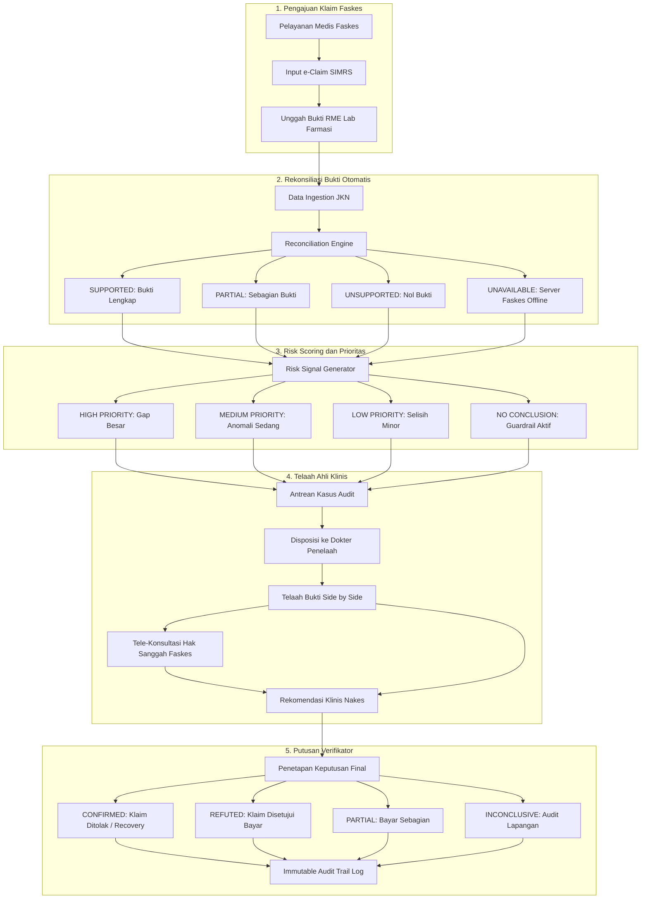

# JKN Integrity Intelligence: Arsitektur Sistem & Alur Proses Bisnis

> **Dokumen Resmi Arsitektur & Spesifikasi Proses Bisnis**  
> *Sistem Pendukung Keputusan (Decision Support System) Pemeriksaan Integritas Klaim JKN Berbasis Rekonsiliasi Bukti Digital & Klinis.*

---

## 1. Maksud & Tujuan Program (Executive Purpose)

### 1.1 Latar Belakang Masalah
Program Jaminan Kesehatan Nasional (JKN) yang dikelola oleh BPJS Kesehatan melayani ratusan juta penduduk Indonesia dengan volume transaksi klaim yang sangat masif setiap harinya. Dalam tata kelola pembiayaan kesehatan, salah satu risiko kerugian finansial terbesar yang mengancam keberlanjutan dana amanah jaminan sosial adalah **Kecurangan Klaim (Healthcare Claim Fraud)**.

Modus kecurangan yang paling merugikan dan sulit dideteksi secara konvensional antara lain:
1. **Klaim Fiktif (Phantom Billing)**: Faskes menagihkan prosedur, pemeriksaan penunjang (laboratorium/radiologi), atau obat-obatan yang secara riil tidak pernah dilakukan kepada pasien.
2. **Klaim Pasien Fiktif (Ghost Enrollee)**: Klaim diajukan atas nama peserta tanpa ada kontak riil antara pasien dan faskes pada tanggal pelayanan.
3. **Upcoding & Unbundling**: Meningkatkan tingkat keparahan diagnosis atau memecah tagihan paket untuk memperoleh tarif klaim INA-CBGs yang lebih tinggi.

### 1.2 Maksud dan Visi Program
**JKN Integrity Intelligence** dikembangkan **bukan** sebagai "mesin pemutus otomatis" yang menuduh pihak faskes secara sepihak, melainkan sebagai **Decision Support System (DSS)** bagi dokter penelaah, verifikator klaim, dan staf audit JKN.

**Prinsip Inti Sistem:**
> *"Detect the Gap. Trace the Evidence. Guide the Review."*
> (Temukan Selisih Bukti. Telusuri Rantai Rekam Medis. Pandu Keputusan Penelaah Manusia.)

### 1.3 Tiga Pilar Guardrail Etis & Regulasi
Untuk mencegah terjadinya salah sangka (*false accusation*) yang dapat mencederai hubungan kemitraan faskes dan BPJS Kesehatan, sistem menerapkan 3 prinsip pembatas (*guardrails*):

```text
┌───────────────────────────────────────────────────────────────────────────┐
│                           3 GUARDRAIL INTEGRITAS                          │
├──────────────────────────────────┬────────────────────────────────────────┤
│ 1. UNAVAILABLE ≠ UNSUPPORTED     │ Bukti yang belum/tidak tersedia di RME │
│                                  │ TIDAK otomatis dicap sebagai manipulasi│
├──────────────────────────────────┼────────────────────────────────────────┤
│ 2. UNSUPPORTED ≠ PROVEN FRAUD    │ Ketiadaan bukti fisik adalah anomali   │
│                                  │ administratif, bukan vonis kecurangan  │
├──────────────────────────────────┼────────────────────────────────────────┤
│ 3. RISK SIGNAL ≠ FINAL DECISION  │ Skor dan sinyal algoritma hanyalah     │
│                                  │ rekomendasi awal; verifikator manusia  │
│                                  │ memegang otoritas keputusan final.     │
└──────────────────────────────────┴────────────────────────────────────────┘
```

---

## 2. Diagram Alur Proses Bisnis End-to-End

Berikut adalah siklus operasional bisnis penanganan klaim dari input hingga penetapan hasil audit:

```text
┌─────────────────────────────────────────────────────────────────────────────┐
│ 1. FASILITAS KESEHATAN (RUMAH SAKIT / KLINIK)                              │
│    • Memberikan pelayanan medis kepada peserta JKN                          │
│    • Input berkas klaim tindakan ke e-Claim / SIMRS                         │
│    • Mengunggah bukti pendukung: EMR/CPPT, lembar lab, radiologi, resep     │
└──────────────────────────────────────┬──────────────────────────────────────┘
                                       │ Pengiriman Berkas Klaim
                                       ▼
┌─────────────────────────────────────────────────────────────────────────────┐
│ 2. DATA INGESTION & MESIN REKONSILIASI BUKTI OTOMATIS                       │
│    • API Ingestion memetakan klaim -> claim_items -> evidence_links         │
│    • Menghitung: Qty Klaim vs Qty Bukti Fisik Terverifikasi                 │
│      - SUPPORTED (100% klop)                                                │
│      - PARTIAL (hanya sebagian didukung berkas)                             │
│      - UNSUPPORTED (0 match / indikasi klaim fiktif)                        │
│      - UNAVAILABLE (server luar offline -> Guardrail On)                    │
└──────────────────────────────────────┬──────────────────────────────────────┘
                                       │ Hitung Evidence Gap
                                       ▼
┌─────────────────────────────────────────────────────────────────────────────┐
│ 3. RISK SIGNAL GENERATOR & CASE PRIORITIZATION                              │
│    • Klasifikasi Modus: PHANTOM_BILLING / GHOST_ENROLLEE / UPCODING         │
│    • Scoring Severity & Nilai Nominal:                                      │
│      - HIGH PRIORITY (Gap besar >= 5 unit / coverage < 50% & nominal besar) │
│      - MEDIUM PRIORITY (Pola utilisasi janggal / gap moderat)               │
│      - LOW PRIORITY (Selisih administratif kecil)                           │
│      - NO CONCLUSION (Bukti unavailable -> tidak divonis fraud)             │
└──────────────────────────────────────┬──────────────────────────────────────┘
                                       │ Agregasi ke Antrean Kasus
                                       ▼
┌─────────────────────────────────────────────────────────────────────────────┐
│ 4. DISPOSISI & TELAAH MENDALAM OLEH DOKTER PENELAAH                         │
│    • Ditugaskan ke dokter spesialis (dr. Anindya / dr. Budi / dr. Ratna)    │
│    • Telaah Evidence Chain & Rekonsiliasi Berdampingan (Side-by-Side)       │
│    • Konfirmasi rekam medis EMR vs item klaim faskes                        │
└──────────────────┬───────────────────────────────────────┬──────────────────┘
                   │                                       │
        Perlu Klarifikasi                          Cukup Bukti
                   │                                       │
                   ▼                                       │
┌──────────────────────────────────────┐                   │
│ 5. KLARIFIKASI & TELE-KONSULTASI     │                   │
│    • Sanggahan dari pihak Faskes     │                   │
│    • Klarifikasi dokumen tertinggal  │                   │
└──────────────────┬───────────────────┘                   │
                   │ Hasil Sanggahan                       │
                   ▼                                       │
┌──────────────────────────────────────────────────────────┴──────────────────┐
│ 6. PENETAPAN KEPUTUSAN FINAL OLEH VERIFIKATOR JKN                           │
│    • CONFIRMED FRAUD   : Klaim fiktif terbukti -> Ditolak / Penagihan Balik │
│    • REFUTED           : Dokumen sah terbukti -> Klaim disetujui dibayar    │
│    • PARTIAL CONFIRMED : Sebagian tindakan fiktif -> Bayar hanya yang valid │
│    • INCONCLUSIVE      : Bukti belum tuntas -> Audit investigasi lapangan   │
└──────────────────────────────────────┬──────────────────────────────────────┘
                                       │ Audit Trail Permanen
                                       ▼
┌─────────────────────────────────────────────────────────────────────────────┐
│ 7. IMMUTABLE AUDIT LOG & RECOVERY                                           │
│    • Catatan identitas penelaah, timestamp, alasan klinis & nominal         │
│    • Rekomendasi perbaikan tata kelola faskes & pengembalian dana           │
└─────────────────────────────────────────────────────────────────────────────┘
```

### Versi Diagram Grafis (Mermaid Flowchart)



---

## 3. Detail Tahapan Proses Bisnis

### Tahap 1: Pengajuan Klaim oleh Fasilitas Kesehatan
- Faskes (Rumah Sakit atau Klinik Pratama) mengajukan berkas klaim atas pelayanan yang telah diberikan kepada peserta JKN.
- Berkas mencakup kode diagnosis ICD-10, kode prosedur ICD-9-CM, jenis perawatan (*Rawat Jalan / Rawat Inap*), total biaya tagihan, serta rincian item tindakan (*claim items*).
- Berkas penunjang diintegrasikan dari SIMRS atau Rekam Medis Elektronik (RME) berupa hasil laboratorium, lembar radiologi, catatan dokter terintegrasi (CPPT), dan bukti peresepan farmasi.

### Tahap 2: Rekonsiliasi Otomatis (*Evidence Matching Engine*)
Mesin audit melakukan perbandingan matematis antara klaim dengan fakta rekam medis:
1. **Quantity Claimed ($Q_{claim}$)**: Jumlah item/prosedur yang ditagihkan.
2. **Quantity Supported ($Q_{supp}$)**: Jumlah bukti fisik/digital yang sah dan tertanggal sama.
3. **Evidence Gap**:
   $$\text{Gap} = Q_{claim} - Q_{supp}$$
4. **Coverage Percentage**:
   $$\text{Coverage} = \left(\frac{Q_{supp}}{Q_{claim}}\right) \times 100\%$$

Status hasil rekonsiliasi per item:
- **`SUPPORTED`**: $100\%$ didukung bukti rekam jejak valid.
- **`PARTIAL`**: Hanya sebagian tindakan yang memiliki berkas pendukung.
- **`UNSUPPORTED`**: $0$ berkas pendukung ditemukan (*zero-match*), indikasi kuat Phantom Billing.
- **`UNAVAILABLE`**: Berkas tidak dapat diakses karena gangguan integrasi/server faskes. Sistem secara otomatis menahan (*hold*) kesimpulan.

### Tahap 3: Deteksi Anomali & Pengelompokan Modus Risiko
Sistem menganalisis sinyal anomali ke dalam kategori modus kecurangan:
- **`PHANTOM_BILLING`**: Prosedur ditagihkan namun tidak ada jejak fisik di lembar perawat, lab, atau farmasi.
- **`GHOST_ENROLLEE`**: Tagihan atas pasien tanpa kontak riil pada faskes bersangkutan.
- **`UPCODING`**: Diagnosis diubah menjadi derajat keparahan lebih tinggi tanpa dasar temuan klinis.
- **`UNNECESSARY_TREATMENT`**: Utilisasi prosedur diagnostik berlebihan yang tidak sesuai pedoman tata laksana klinis (*Clinical Pathway*).

### Tahap 4: Pembentukan Kasus & Penetapan Prioritas Telaah
Klaim yang terindikasi anomali diagregasikan menjadi satu berkas kasus investigasi (`Case`).
Prioritas telaah ditentukan berdasarkan matriks:
- **`HIGH PRIORITY`**: Gap bukti besar ($\ge 5$ unit atau coverage $< 50\%$) dengan nilai tagihan signifikan.
- **`MEDIUM PRIORITY`**: Pola ketidaksesuaian sedang atau coverage parsial.
- **`LOW PRIORITY`**: Selisih administratif minor dengan nilai tagihan kecil.
- **`NO CONCLUSION`**: Kasus dengan status bukti `UNAVAILABLE`.

### Tahap 5: Disposisi & Telaah Mendalam oleh Dokter Penelaah
- Berkas kasus didisposisikan kepada Dokter Penelaah sesuai bidang keahliannya (misal: spesialis patologi klinik untuk audit laboratorium, spesialis anak/penyakit dalam untuk audit rawat inap).
- Dokter penelaah memeriksa **Evidence Chain**:
  1. *Identitas Pasien & Faskes*
  2. *Lembar Tagihan Faskes vs Rekam Medis Fisik (Side-by-Side)*
  3. *Tabel Rekonsiliasi Rincian Tindakan*
  4. *Rantai Bukti Digital (Lab, Radiologi, CPPT, Farmasi)*

### Tahap 6: Hak Sanggah, Klarifikasi & Tele-Konsultasi Faskes
- Faskes memiliki hak untuk mengklarifikasi temuan sistem (*due process*).
- Fitur **Tele-Konsultasi Klinis** memungkinkan dokter penelaah dan staf verifikator berkomunikasi langsung dengan manajemen rumah sakit atau dokter penanggung jawab pelayanan (DPJP) faskes untuk memverifikasi keabsahan dokumen fisik yang tercecer.

### Tahap 7: Penetapan Keputusan Akhir Verifikator & Jejak Audit
Setelah telaah selesai, verifikator menetapkan salah satu dari 4 hasil telaah:
1. **`CONFIRMED`**: Terkonfirmasi klaim fiktif. Tagihan dibatalkan atau dilakukan penagihan kembali (*clawback*).
2. **`REFUTED`**: Bantahan faskes diterima dan dokumen terbukti sah. Klaim disetujui untuk dibayarkan.
3. **`PARTIALLY_CONFIRMED`**: Hanya item yang memiliki bukti sah yang disetujui pembayarannya.
4. **`INCONCLUSIVE`**: Dokumen belum memadai untuk kesimpulan final, dieskalasi ke audit fisik lapangan.

Semua aktivitas, pergantian status, catatan klinis, dan identitas penelaah dicatat ke dalam **`audit_logs`** yang bersifat *append-only* (tidak dapat diubah atau dihapus).

---

## 4. Arsitektur Teknis Sistem (System Architecture)

### 4.1 Diagram Komponen Arsitektur

```text
┌──────────────────────────────────────────────────────────────────────────────┐
│                             PRESENTATION LAYER                               │
│  React 18 + Vite (SPA) — Desain Human-Centric (Figtree & DM Sans)           │
├──────────────────────────────────────────────────────────────────────────────┤
│  • Executive Dashboard (KPI Klaim, Anomali, Tingkat Ketercakupan)            │
│  • Case Queue & Filtering (Status, Prioritas, Modus Risiko, Penugasan Nakes) │
│  • Case Detail Workspace (Evidence Chain, Side-by-Side Reconcile, Audit Form)│
│  • Claim Audit Input Simulation (Alat Simulasi Input & Pengujian Aturan)     │
│  • Tele-Consultation Modal (Komunikasi Dokter & Hak Sanggah Faskes)          │
└───────────────────────────────────────┬──────────────────────────────────────┘
                                        │ HTTP / REST / JSON
                                        ▼
┌──────────────────────────────────────────────────────────────────────────────┐
│                             APPLICATION API LAYER                            │
│  Node.js + Express.js — Port 3000                                            │
├──────────────────────────────────────────────────────────────────────────────┤
│  • /api/auth          : Autentikasi Staf JKN & Dokter Penelaah               │
│  • /api/dashboard     : Agregasi Metrik, Distribusi Risiko, Kasus Teratas    │
│  • /api/cases         : Operasi CRUD Kasus, Disposisi, Filter Lanjutan       │
│  • /api/claims        : Data Rincian Klaim, Item Tindakan & Bukti Terkait    │
│  • /api/analysis      : Engine Rekonsiliasi, Kalkulasi Gap & Prioritas       │
│  • /api/validation    : Validasi Struktur & Integritas Dokumen Masukan       │
└───────────────────────────────────────┬──────────────────────────────────────┘
                                        │
                    ┌───────────────────┴───────────────────┐
                    ▼                                       ▼
┌──────────────────────────────────────┐ ┌─────────────────────────────────────┐
│       DECISION ENGINE MODULES        │ │           DATA PERSISTENCE          │
│  (Pure Logic / Deterministic)        │ │           PostgreSQL 14+            │
├──────────────────────────────────────┤ ├─────────────────────────────────────┤
│ 1. reconciliation.js                 │ │ • patients, providers, encounters   │
│    Hitung Gap & Coverage Persen      │ │ • diagnoses, procedures             │
│ 2. riskSignal.js                     │ │ • claims, claim_items, billing_items│
│    Evaluasi Indikasi Phantom Billing │ │ • evidence_links                    │
│ 3. casePriority.js                   │ │ • risk_signals, cases               │
│    Matriks Prioritas & Safety Rules  │ │ • review_outcomes                   │
│ 4. auditLogService.js                │ │ • audit_logs (Immutable Trail)      │
│    Jejak Rekam Keputusan & Aktor     │ │                                     │
└──────────────────────────────────────┘ └─────────────────────────────────────┘
```

### 4.2 Rincian Modul Backend

| Direktori / File | Tanggung Jawab Utama |
|---|---|
| `backend/src/server.js` | Entry point server Express, bootstrap koneksi database PostgreSQL, listening port 3000. |
| `backend/src/app.js` | Konfigurasi middleware Express (CORS, JSON parsing, logging, error handling, route registry). |
| `backend/src/decision-engine/reconciliation.js` | Logika inti perbandingan matematis antara item klaim dengan dokumen bukti fisik/digital. |
| `backend/src/decision-engine/riskSignal.js` | Algoritma penentuan ada/tidaknya sinyal risiko kecurangan klaim. |
| `backend/src/decision-engine/casePriority.js` | Matriks penentuan prioritas kasus (`HIGH`, `MEDIUM`, `LOW`, `NO_CONCLUSION`). |
| `backend/src/controllers/caseController.js` | Menangani pembacaan antrean kasus, detail rantai bukti, penugasan dokter, dan submit hasil telaah. |
| `backend/src/controllers/dashboardController.js` | Mengagregasi metrik kinerja klaim, total potensi kerugian, dan distribusi risiko faskes. |
| `backend/src/controllers/auditInputController.js` | Menerima berkas klaim baru dan menjalankan audit instan secara real-time. |
| `backend/src/db/index.js` | Konfigurasi connection pooling PostgreSQL (`pg` pool) dan eksekusi kueri transaksi. |

### 4.3 Skema Basis Data Relasional

```text
[patients] 1 ──── ∞ [encounters] 1 ──── ∞ [diagnoses]
                           │
                           ├───── ∞ [procedures]
                           │
                           └───── 1 [claims] 1 ──── ∞ [claim_items] 1 ──── ∞ [evidence_links]
                                       │                    │
                                       │                    └───── 1 [billing_items]
                                       │
                                       ├───── ∞ [risk_signals]
                                       │
                                       └───── 1 [cases] 1 ──── ∞ [review_outcomes]
                                                  │
                                                  └───── ∞ [audit_logs]
```

**Karakteristik Kunci Basis Data:**
1. **Pemisahan Sumber Kebenaran**: Data klaim faskes (`claims`, `claim_items`, `billing_items`) disimpan terpisah dari data rekam medis objektif (`encounters`, `procedures`, `evidence_links`).
2. **Integritas Referensial**: Foreign key cascade dan indeks terarah pada `claim_id`, `claim_item_id`, dan `case_id` untuk query performa tinggi.
3. **Penyimpanan Jejak Audit Permanen**: Tabel `audit_logs` menyimpan setiap perubahan status, pengubah data, dan timestamp yang tidak dapat dimanipulasi oleh aplikasi.

---

## 5. Matriks Peran Pengguna (Role-Based Access)

| Peran | Profil Pengguna | Tanggung Jawab & Hak Akses |
|---|---|---|
| **Dokter Penelaah Spesialis** | dr. Anindya Kusuma, Sp.PK<br>dr. Budi Santoso, Sp.A<br>dr. Ratna Juwita, Sp.PD | • Meninjau berkas klaim yang ditugaskan.<br>• Menganalisis kesesuaian klinis rekam medis vs tagihan faskes.<br>• Melakukan tele-konsultasi klarifikasi dengan pihak faskes.<br>• Memberikan rekomendasi medis (Didukung Bukti / Indikasi Fiktif). |
| **Verifikator Klaim / Staf JKN** | Staf Fraud JKN (Ahmad Fauzi) | • Memantau seluruh antrean kasus di tingkat regional/cabang.<br>• Melakukan disposisi penugasan kasus ke dokter spesialis terkait.<br>• Menetapkan putusan hukum/administratif akhir (`CONFIRMED`, `REFUTED`, dll.).<br>• Menerbitkan surat rekomendasi pengembalian dana (*recovery*). |
| **Administrator Sistem** | IT Administrator | • Pengelolaan konfigurasi konektivitas basis data dan service integrasi RME.<br>• Pemantauan performa server dan kepatuhan log audit. |

---

## 6. Keunggulan Dibandingkan Pendekatan Konvensional

1. **Transparansi Berbasis Bukti (Explainable & Defensible)**:
   Tidak seperti sistem AI kotak hitam (*black-box machine learning*) yang hanya mengeluarkan persentase probabilitas tanpa penjelasan, JKN Integrity Intelligence menyajikan bukti nyata per item tindakan: dokumen mana yang ada, dokumen mana yang hilang, dan berapa selisih uangnya.
2. **Kepatuhan Terhadap Regulasi Kesehatan**:
   Dirancang selaras dengan prinsip tata kelola pencegahan kecurangan JKN (Permenkes No. 16 Tahun 2019 tentang Pencegahan dan Penanganan Kecurangan serta Pengenaan Sanksi Administrasi terhadap Kecurangan dalam Program JKN).
3. **Pengalaman Pengguna Humanis & Bersih**:
   Antarmuka menggunakan tipografi modern **Figtree & DM Sans** yang bersih dan profesional, menghilangkan kesan "sistem robotik / coding terminal", serta memprioritaskan kemudahan penelaah dalam membaca berkas medis bervolume besar secara nyaman dan akurat.

---
*Dokumen ini disusun untuk tim teknis, tim klinis, dan pemangku kepentingan program JKN Integrity Intelligence.*
